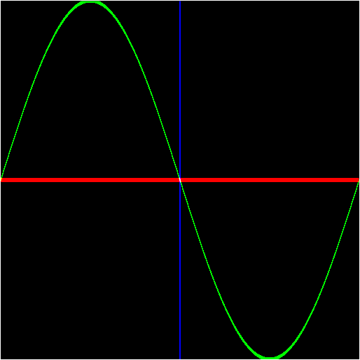

## 使用 GLSL 绘图初试

看了一部分 [《The Book of Shaders》](https://thebookofshaders.com/?lan=ch)之后大受启发，之前画三角形，画矩形以及画其他的图形都是在 JS 计算好各个点的位置，然后通过 buffer 传递到顶点着色器中，然后绘制出图形。这些计算点位的工作主要集中在 CPU 端进行，这种绘制方式大大浪费了 GPU 并行计算的能力，其实我们只在片元着色器也能绘制出这些图形，并且效率更高。

在片元着色器中绘图，我们将使用一个重要的内置变量**vec4 gl_FragCoord**，在官方文档中这样解释：

> Available only in the fragment language, gl_FragCoord is an input variable that contains the window relative coordinate (x, y, z, 1/w) values for the fragment. If multi-sampling, this value can be for any location within the pixel, or one of the fragment samples. This value is the result of fixed functionality that interpolates primitives after vertex processing to generate fragments. The z component is the depth value that would be used for the fragment's depth if no shader contained any writes to gl_FragDepth

gl_FragCoord 仅在片段着色器中可用，是一个输入变量，包含片段的窗口相对坐标（x，y，z，1 / w）值。这句话的意思是它的坐标就是当前片段的窗口相对坐标，回想起 webGL 的绘制方式：确定了定点之后，会调用片段着色器进行逐像素渲染。这时，每一个像素的坐标便是 gl_FragCoord 的 xyz 值。它的值的范围为 0 到渲染区域的宽高。**它的坐标原点在左下角，x 向右递增，y 向上递增。**

### 绘制准备工作

首先，我们要使用 gl_FragCoord，需要先创建一个简单的 webGL 程序，我们绘制 2 个三角形组成一个矩形，在绘制三角形的时候 webGL 会调用片元着色器对三角形进行光栅化，在光栅化的过程中调用 fragment shader 进行对每个像素进行光栅化，在对每个像素进行处理的时候，当前被处理像素的坐标我们通过 gl_FragCoord 就可以得到。

绘制三角形步骤略。

webgl 坐标及颜色范围都在[-1,1]中间，而 gl_FragCoord 的范围是[0,width],[0,height],因此在使用中我们通常需要(也可以不做处理)归一化处理。
我们需要在 fragment 中获取 gl.canvas 的高宽，因此我们需要一个变量

```glsl
uniform vec2 uResolution;
```

在 JS 程序中将 canvas 的高宽传给它，

```js
const uResolution = gl.getUniformLocation(program, 'uResolution')
gl.uniform2f(uResolution, gl.canvas.width, gl.canvas.height)
```

然后 vec2 st=gl_FragCoord.xy/uResolution;得到的就是归一化坐标值。

### 绘制正弦曲线

现在，我们可以尝试绘制一条正弦曲线 y=sin(x),但是我们已知的只有画布各个点的坐标值，我们可以将在正弦曲线上的点颜色设置为绿色，将正弦曲线外的点颜色设置为黑色，这样就能将曲线绘制出来；并且我们坐标的递增为一个像素值，y 值不可能完全与 sin(x)相等，我们需要设置一个范围，比如正负 0.01，只要 y 值落在这个范围内，我们就认为 y 的值为 sin(x),这样能够生成更为平滑的曲线，避免锯齿。

首先我们写一个 plot 函数，该函数接收 2 个值，一个真实坐标值，一个目标值，如果真实值在目标值误差范围内则返回 1.0，否则范围 0.0

```glsl
float plot(float sy,float y){
  // float p=smoothstep(sy+.01,sy,y)-smoothstep(sy,sy-.01,y);
  // return sign(p);
  if(y-.01<sy && sy<y+.01){
    return 1.;
  }else{
    return 0.;
  }
}
```

由于归一化之后 gl_FragCoord 坐标范围为[0,1]，为了绘制正弦曲线，我们将 x 轴范围映射到[0,2π]，y 轴范围映射到[-1,1]。main 函数如下所示：

```glsl
void main(){
  // gl_FragCoord是着色器当前位置的坐标值，xy范围为canvas的[0,width],[0,height]
  // 下面st将gl_FragCoord转为webgl坐标[0,1]
  vec2 st=gl_FragCoord.xy/uResolution;
  float PI=3.1415926;

  // x范围转到[0,2PI]
  float tx=st.x*2.*PI;
  // x范围转到[-1,1]
  float ty=(st.y*2.)-1.;

  // y = sin(x) 曲线
  float pct=plot(ty,sin(tx));
  vec3 color=pct*vec3(0.,1.,.0);

  gl_FragColor=vec4(color,1.);
}
```

如果点在 sin(tx)上，pct 为 1.0，乘以 vec3(0.,1.,.0)为其本身，否则，跑 pct 为 0.0,color 值为 vec3(0.0,0.0,0.0);
这样点在正弦曲线上颜色将为绿色，而曲线之外的部分颜色为黑色。

接着，我们可以添加 x 轴与 y 轴辅助线，x 轴方程为 y=0,y 轴我们绘制为 x=PI，接着修改我们的 main 函数：

```js
// y=0 直线 ，即X轴
  float xPct=plot(ty,0.);
  vec3 xAxisColor=xPct*vec3(1.,0.,0.);

  // x=PI 直线，即 Y轴
  float yPct=plot(tx,PI);
  vec3 yAxisColor=yPct*vec3(0.,0.,1.);

  // 颜色相加即的得到要绘制的图形
  color+=xAxisColor+yAxisColor;
```

最后，显示的颜色最终值为三个绘图函数颜色值的和，如果在 y=sin(x)上，颜色为绿色；如果在 y=0 上，颜色为红色，如果在 x=π 上，颜色为蓝色。
最终我们的成果如下图所示：



### 总结

通过这个示例，我们可以绘制出更多的图形，根据各种造型函数，将函数区域与非函数区域绘制为 2 种不同的颜色我们便可以绘制出各种形状；另外，我们可以将多个绘图函数组合起来，绘制出更加多样的效果。而且这些直接在 GPU 中计算，性能将比通过 CPU 传递数据绘制更快。

学习资源：

[webGL 基础知识](https://webglfundamentals.org/webgl/lessons/zh_cn/webgl-fundamentals.html)

[着色器之书](https://thebookofshaders.com/?lan=ch)

[着色器资源网](https://www.shadertoy.com/)

[距离场着色器](http://iquilezles.org/www/articles/distfunctions2d/distfunctions2d.htm)
