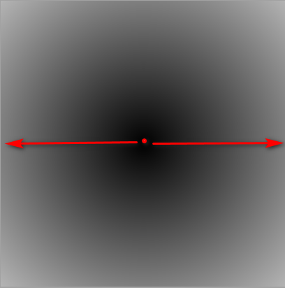
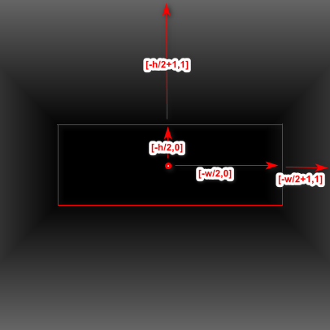

##  webGL二维距离场

**距离场**：在着色器中绘图，类似于在一个方格纸上涂色，每个方格就是一个像素点。想象一下如果我们要在方格纸上绘制一个圆该怎么做呢，我们只需要把圆形内部区域涂成一个颜色，圆形外部区域的涂成另外一种颜色(或者不涂色)，这样我们便有了一个圆。在数学上我们怎么定义圆呢？及圆周上的点到圆心的距离等于半径，圆内部的点到圆心的距离小于半径，圆外部的点到圆心的距离大于半径。这样一圈一圈，我们可以在图上得到每一个点到圆心的距离，我们称之为：距离场。


### 移动

在计算距离场的时候一般将坐标中点设置为原点，方便我们计算。但是通常，图形不是绘制在原点的位置，这样我们便需要原点位置设置在图形的中点，移动到原点是一个几乎所有图形都会用到的操作。如果图形的中点在(0.5,0.5)，那么将要将(0.5,0.5)设置为原点，我们只需要减去(0.5,0.5)，那么在绘制过程中便是以(0.5,0.5)为原点的。

```glsl
vec2 translate(in vec2 p,in vec2 c) {
	return p-c;
}
```

### 圆形距离场

圆形的距离计算最为简单，我们只需要计算坐标到圆心的距离即可，假设圆心在(0.5,0.5)，由于着色器坐标归一化之后范围为[0,1]，那么绘图区域中点到圆心的距离范围为[0,0.5],如下图所示：



计算代码可以写为这样：

```glsl
#ifdef GL_ES
precision mediump float;
#endif

uniform vec2 uResolution;

void main(){
  vec2 st=gl_FragCoord.xy/uResolution;
  vec2 center=vec2(.5);
  float dis=distance(center,st.xy);
  gl_FragColor.rgb=dis*vec3(1.);
  gl_FragColor.a=1.;
}
```


### 矩形距离场

矩形距离场稍微要复杂一些，假设矩形中点在正中心，长为w，宽为h，那么对于矩形内部的点来说，它们的x轴到中心的距离为[0,w/2]，它们的y轴到中心的距离为[0,h/2]；而矩形外面的的坐标，它们的x轴到中心的范围为[w/2,0]，它们Y轴到中心点范围为[h/2,1],如下图所示：



