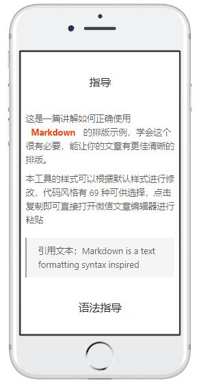

最近闲来无事，又开始着手打理自己的公众号，想着还是需要有个地方记录一下自己的学习情况以及跟大家分享，长久以来，我都是习惯于使用 markdown 来写文章，但是当我打开微信公众号新建一篇图文素材，what?这简陋的富文本编辑器，窗口还这么小，一边写文章还要一边进行排版，都 9012 年了，微信的交互还是这样？

实在难以吐槽。打开浏览器一搜，什么 135 编辑器啥的，这花花绿绿的是啥，我总算知道了有些公众号里那些非主流的排版是从哪里来的了。

作为程序员，我经常使用 markdown 来编写博客，markdown 语法简洁容易掌握，同时又可以专注于写作本身，不用写两句然后又转去排版，思路比较连贯，那么，不可以直接把 markdown 预览后的格式直接粘贴到微信里面吗？

答案是可以的，网上有很多这样的尝试，做的比较好的有两个:Lyric 的[wechat-format](https://labs.lyric.im/wxformat/)和胡子哥的[WxMarkdown](http://md.barretlee.com/)两个都写的比较好了，能实现大部分的需求，但是他们都没有提供自定义样式，我只能选择和他们提供的样式一样。这就很束缚了，我喜欢放飞自我的感觉，那么，只能自己动手来实现了。

我基于 Lyric 的代码进行修改，思路如下：

- 解析 markdown，我使用[marked](https://github.com/markedjs/marked)进行解析，marked 会将 markdown 解析为 HTML 元素，并且在期 render 中可以对各个元素进行处理，比如应用自己设定的样式之类，十分方便。

- 代码高亮，作为程序员，代码高亮是必不可少的。我使用[highlight.js](https://highlightjs.org/)处理 marked 解析之后的 code 标签进行代码高亮，highlight 有上百种代码样式，但是并不是所有的都很美观，因此我删除了其中的一些样式。在切换高亮风格的时候只需要切换 css 文件即可。我们只需要在初始化的时候创建一个 link 标签，在切换样式的时候动态修改 link 标签的 href 属性就可以了。

- 样式自定义。自定义样式只需要在默认的样式文件上修改保存即可。本来自定义样式以 css 文件方式存储最为简单，但是在修改 css 的时候获取此刻编辑的标签十分困难，不够直观。因此，我选择以 JSON 存储样式，使用[jsoneditor](https://github.com/josdejong/jsoneditor)作为样式编辑器，我们就可以在编辑某个样式的时候高亮当前编辑的元素，使得编辑更加直观。

由于没有后台支撑，自定义样式目前只支持创建一个(太懒，不想写了),而且保存在浏览器的 localStorage,因此在您清除浏览器缓存之后可能会消失，建议先保存到本地以防不测。

之后，电脑上的排版总是和手机会有些不一样，主要是屏幕尺寸的问题，于是我参考墨刀做了个手机预览的功能，可以直观的看到你的文章在手机上是否合适，这个还是十分实用的，类似于这样的效果：

大道至简，这才是我想要的编辑器，专注于文章本身而不是在撰写和排版间来回切换，有同样烦恼的朋友可以尝试下，在线地址是：

http://zhouzhili.github.io/wechatformat/index.html#/

想要研究 markdown 如何解析成微信支持格式的也可以前往查看，网站上有源码地址，大家也可以动手做一个属于自己的格式转换器。
